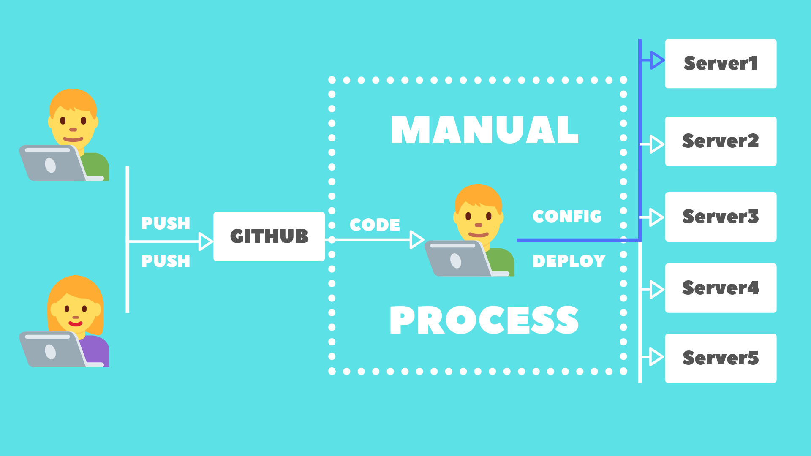
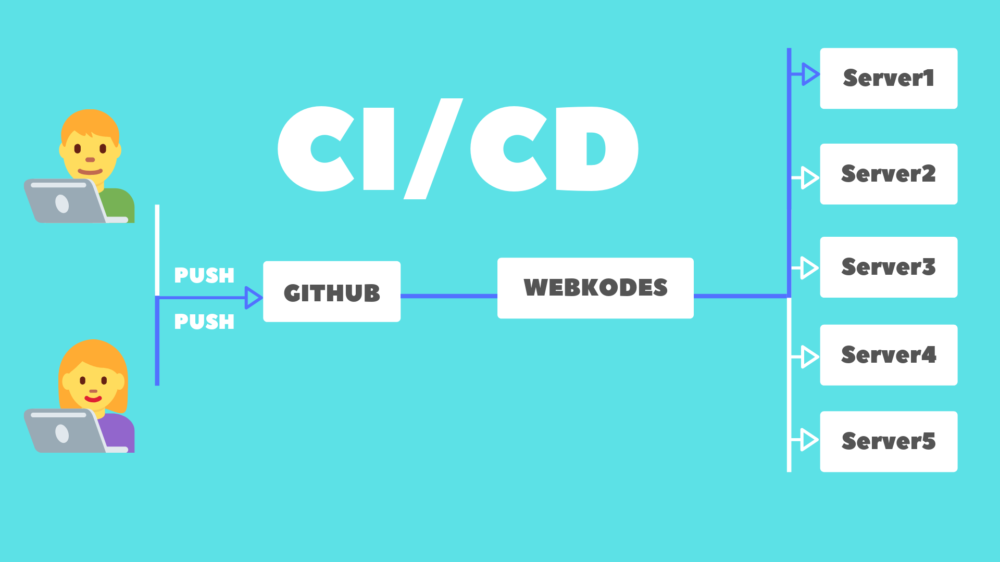

# Webkodes
A multi server management and app deployment platform which will enable small and medium sized organizations to manage and deploy their apps with CI/CD suppport.

## Current Workflow
Here is a slide explaining the current workflow of the organizations.
* Developer pushes the code and pings the admin
* Admin detects the push and downloads the code
* Admin does configuration on the code
* Admin deploys the code to the required server 

 

## Whats the Problem with this ?
These is a lot of time wasted in the admin configuration and review process which can be saved if we are able to somehow automate that process. Also these small/medium sized organizations, genarally do not have a means to manage all of their servers and apps in one dashboard.

## Webkodes Workflow
Here is a slide explaining the workflow of webkodes.
* Developer pushes the code
* Webkodes detects the push
* Webkodes does configuration on the code
* Webkodes deploys the code to the required server 
* Webkodes informs the admin of the deployment

 

## Webkodes Features
Here are some of the features that webkodes provides.
* Multiple Server Management
* Multiple Project/App Management
* CI/CD for better developemt experience
* Helps in Rapid Product Development
* Multiple Database Management
* Multiple Language Support (PHP/NODE)
* Project/App Analytics 

## Conclusions

* Developers Happy  :smiley_cat:
* Clients Happy
* Admins Happy

What else do you need ? :sunglasses:

## Developer(s)
**Ashutosh Dubey**
